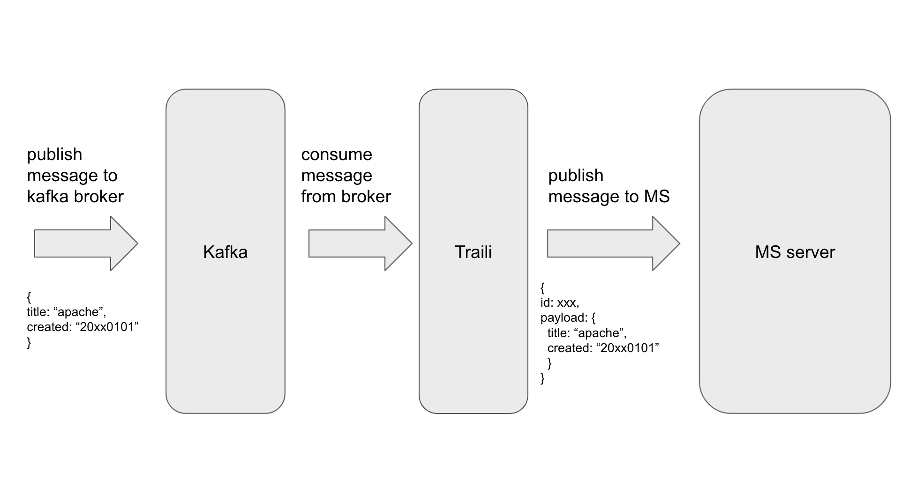

# Traili
// TODO: Unprepared status


## Basic flow



## Run via source in local
### Prepare...
1. Run MS in local
2. Run Kafka server
3. Run project with command:
```sh
$ cargo run -- --config [config-file-path]
```

### Config file example
[config.yml]
```yml
meilisearch:
  host: http://localhost:7700
  master_key: masterKey
  document: traili

consumers:
  input_type: kafka
  brokers: 127.0.0.1:9092,127.0.0.2:9092
  topics: [test-topic]
  group_id: group
  log_level: debug
  options:
    session.timeout.ms: 6000
    enable.auto.commit: true
    allow.auto.create.topics: true
    auto.offset.reset: smallest
```
